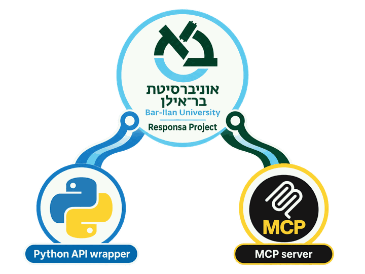

<p align="center">
  
</p>

# Responsa Bridge

Search the Bar-Ilan Responsa Project, walk its sources tree and fetch full
texts — from Claude (as an MCP server) or from Python.

The Responsa desktop app has no CLI, SDK or COM interface, so Responsa Bridge
works by automating its real window: it types the query, waits for the
results, prints them to PDF and parses the PDF back into structured data.

> **Unofficial.** This project is not affiliated with, endorsed by or
> supported by Bar-Ilan University or the Responsa Project. It contains no
> Responsa texts. It only drives a copy of the app that you have installed and
> licensed yourself.

## Requirements

- Windows
- The Responsa desktop app, **version 33**, installed in its default location,
  with its license dongle plugged in
- A PDF printer: **Microsoft Print to PDF**, which comes with Windows 10/11
  (if it's missing, enable it under *Turn Windows features on or off*).
  Results are extracted by printing to it, and any printer with "PDF" in its
  name works.
- Python 3.10 or newer (64-bit is fine, even though Responsa itself is
  32-bit)
- An unlocked, interactive desktop session, because the automation sends
  real keystrokes. Run Responsa and Python at the same privilege level:
  don't run only one of them as administrator, or Windows blocks the input.

## Install

```powershell
git clone https://github.com/OWNER/responsa-bridge.git
cd responsa-bridge
python -m venv .venv
.venv\Scripts\python -m pip install -e .
```

This installs the `responsa_api` Python package and the `responsa-bridge-mcp`
command into `.venv`.

## Use it from Claude

### Claude Code

From the repo directory (PowerShell):

```powershell
claude mcp add responsa-bridge -- "$PWD\.venv\Scripts\responsa-bridge-mcp.exe"
```

(In cmd.exe, use `"%CD%\.venv\Scripts\responsa-bridge-mcp.exe"`.) Then
`claude mcp list` should show `responsa-bridge: ... ✔ Connected`.

### Claude Desktop

Add this to `claude_desktop_config.json`, using the full path to your clone:

```json
{
  "mcpServers": {
    "responsa-bridge": {
      "command": "C:\\path\\to\\responsa-bridge\\.venv\\Scripts\\responsa-bridge-mcp.exe"
    }
  }
}
```

### Tools

| Tool | What it does |
|---|---|
| `search` | Runs a Responsa query, optionally limited to some books, and returns the hits with their citations and context |
| `get_result_text` | The full text of one hit from the last search |
| `browse` | Walks the sources tree (categories → books → chapters → texts) and reads a text |
| `hard_reset` | Restarts Responsa when it gets stuck |

The docstrings in [`responsa_mcp/tools.py`](responsa_mcp/tools.py) are the
exact descriptions Claude sees.

Things you can ask:

- *"Search Responsa for כוכב near לבנה in the Mishna and show me the hits."*
- *"Where in the Shulchan Aruch is the phrase כזית בכדי אכילת פרס discussed?"*
- *"Read me Bereshit chapter 1 from the Browse tree."*

## Use it from Python

```python
from responsa_api import ResponsaClient, BookScope

with ResponsaClient() as client:
    results = client.search("*כוכב# [-3:3] *לבנה#", books=BookScope.MISHNA)
    for hit in results.hits:
        print(hit.index, hit.citation)

    # The complete text of one result (a long source can take a few minutes):
    source = client.get_result_text(results.hits[0].index)
    print(source.text)
```

`ResponsaClient` attaches to a Responsa that is already running, or launches
one. It never closes the app, so the next call starts fast. Its whole surface
is `start()`, `close()`, `hard_reset()`, `search()`, `get_result_text()` and
`browse()`. The docstrings in
[`responsa_api/client.py`](responsa_api/client.py) cover every argument.

- **`hard_reset()`** really quits Responsa (`close()` only detaches) and
  starts a fresh instance. Use it to recover when the app is stuck, and only
  when nothing else needs the current session. With `clear_windows=True`
  (the default) it also closes the windows Responsa restores from its last
  session.
- **`books=`** narrows the search: a `BookScope`, a list of them, or the
  exact name of a node in the sources tree
  ([`scripts/sources_tree.txt`](scripts/sources_tree.txt) lists them all).
- **Big result sets are slow to extract**, roughly 3 seconds per page.
  `search(..., max_hits=N)` or `ResponsaClient(time_budget=SECONDS)` puts a
  bound on that. `SearchResults.total_hits` and `.truncated` tell you what
  was left out.

### Query syntax

Queries use Responsa's own syntax:

| Syntax | Meaning |
|---|---|
| `word` | Only that exact standalone form, with no prefix or suffix attached |
| `word1 word2` | Both words, next to each other |
| `*word`, `word*`, `*word*` | Anything attached before / after / on both sides (a free wildcard) |
| `#word`, `word#`, `#word#` | Only a real Hebrew grammatical prefix (ו/ה/ב/כ/ל/מ/ש…) / suffix (ים/ות…) |
| `word1 [-3:3] word2` | Up to 3 other words in between (before:after), instead of adjacent |
| `(word1/word2/...)` | Any one of these at this position, e.g. `(הלך/הלכה)`; entries may use `*`/`#` |

`*` and `#` can be mixed on the two sides of one word (`#word*`). Words may
contain only Hebrew letters and digits, so strip nikud first.

### Browsing the sources tree (עיון)

`browse()` walks Responsa's hierarchy of sources (categories, books,
chapters, … down to the texts) one call at a time. Each call continues from
where the last one left off:

```python
with ResponsaClient() as client:
    client.browse().options              # top level: the categories
    client.browse('תנ"ך').options        # its books
    client.browse("יחזקאל").options      # "ספר יחזקאל" -> its chapters
    r = client.browse("ב")               # "פרק ב" is a text: r.text.text
    r = client.browse("ג")               # its sibling, still in the same book
    client.browse(['תנ"ך', "בראשית", "א"])  # or several steps in one call
    client.browse()                      # no arguments: back to the top
```

Each call returns a `BrowseResult` with one of three things:

- `options` when it lands on a section;
- `text` when it lands on a text;
- `error` (`BrowseError.NOT_FOUND`, `AMBIGUOUS` or `NOT_A_SECTION`) when the
  name doesn't match. Nothing moves in that case.

A name only has to identify the entry: "ב" is enough for "פרק ב", quote marks
are ignored, and an entry that starts with the name beats one that only
contains it. `exact=True` demands the complete name. Reading a leaf gives
just that leaf's text (one verse, one Mishnah, one page side), not its whole
section.

The tree comes from a cache bundled with the package
(`responsa_api/internal/versions/v33_browse_cache/`), so moving through it
never touches Responsa; only reading a text does. If Responsa's data changes,
rebuild the cache with `python scripts/build_browse_cache.py`. That takes
about 80 minutes for the ~1.8 million entries. Meanwhile nothing else may
use Responsa, and don't close its Browse window.

## Limitations

- **Don't use the computer while a call runs.** The automation sends real
  keystrokes, which go to whichever window has focus. Also keep the screen
  from locking or the screensaver from starting during long calls. (The test
  suite keeps the display awake by itself.)
- **One caller at a time.** Responsa has one window, so calls are
  serialized. A second MCP server process that tries to run a tool while
  another is busy fails immediately with "Responsa is busy" instead of
  queuing.
- **Version 33 only.** Every control ID and dialog title is specific to one
  Responsa build. To support another version, copy
  `responsa_api/internal/versions/v33.py` to `vNN.py`, re-run the
  inspection tools in `scripts/` against the new build, and pass it as
  `ResponsaClient(config=...)`.

## Troubleshooting

**The first call is slow.** The first tool call launches Responsa if it isn't
running and waits until the app is really responsive. Responsa reopens
whatever windows were open when it last closed, so this can take up to a
minute. Later calls reuse the running app.

**A call seems stuck.** First check whether another window took the focus;
the automation's keystrokes then go there instead of to Responsa. If
Responsa itself is in a confused state (a leftover dialog, repeated
timeouts), `hard_reset` restarts it cleanly.

**Claude still shows old tool descriptions.** Claude loads the tool
descriptions when it starts the server, so restart Claude Code (or Claude
Desktop) after updating this repo.

**Logs.** Every MCP tool call, with its full arguments and outcome
(including the complete traceback of any failure), goes to a rotating log
(~12 MiB in total) at `%LOCALAPPDATA%\responsa-bridge\logs\mcp_server.log`.
Claude only sees a generic "Error executing tool" for unexpected failures, so
look here first. The logged arguments are usually enough to reproduce the
call from Python.

**Errors.** Everything raised is a `ResponsaError`:

| Exception | Meaning |
|---|---|
| `ResponsaLaunchError` | Responsa failed to start (e.g. missing license dongle) |
| `ResponsaTimeoutError` | Something didn't finish in time |
| `ResponsaSearchError` | The search couldn't complete |
| `ResponsaInvalidQueryError` | (a `ResponsaSearchError`) Responsa rejected the query, e.g. because of nikud |
| `ResponsaTooManyResultsError` | (a `ResponsaSearchError`) Over ~32000 results; narrow the query |
| `ResponsaFocusError` | Another application had keyboard focus; don't use other windows while a call runs |
| `ResponsaSessionLockedError` | The Windows session is locked or disconnected; unlock it and retry |
| `ResponsaBrowseCacheError` | The Browse tree cache is missing or out of date |

A query with no matches is not an error. It returns empty `hits`.

## Development

```powershell
.venv\Scripts\python -m pip install -e ".[test]"
.venv\Scripts\python -m pytest
```

The tests are real and unmocked: they drive the live app, so they need
Responsa and its dongle, and you can't use the computer while they run. The
default run takes about twenty minutes. The one deliberately slow test is
excluded by default; run it with `pytest -m slow`.

You can also run the MCP server directly with `python -m responsa_mcp`.

```
responsa_api/           the Python API
  client.py             ResponsaClient
  results.py            Hit, SearchResults, SourceText, BrowseResult, BrowseError
  book_scope.py         BookScope
  exceptions.py         the errors above
  internal/             implementation, not part of the API
    automation.py       the GUI-automation driver behind ResponsaClient
    parsing.py          turns the exported PDF into Hit / SourceText
    browse_gui.py       Browse dialog / tree access (GUI side of browse())
    browse_tree.py      cached tree + name matching (no GUI)
    winutil.py          Win32 helpers
    versions/v33.py     every control ID / dialog title for Responsa v33
    versions/v33_browse_cache/   the crawled Browse tree
responsa_mcp/           the MCP server
  tools.py              the 4 tools, and the source of their MCP descriptions
  lifecycle.py          the shared ResponsaClient + in-process/cross-process locks
  server.py             builds and runs the MCP server (responsa-bridge-mcp)
scripts/                developer tools: inspecting the GUI, building the Browse cache
tests/                  the live pytest suite
```

## License

[MIT](LICENSE)
